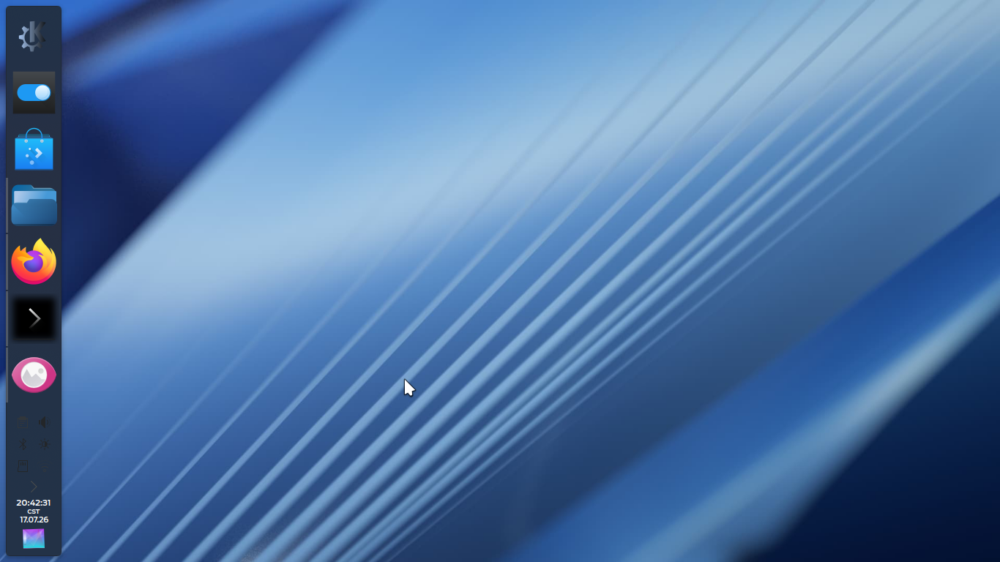
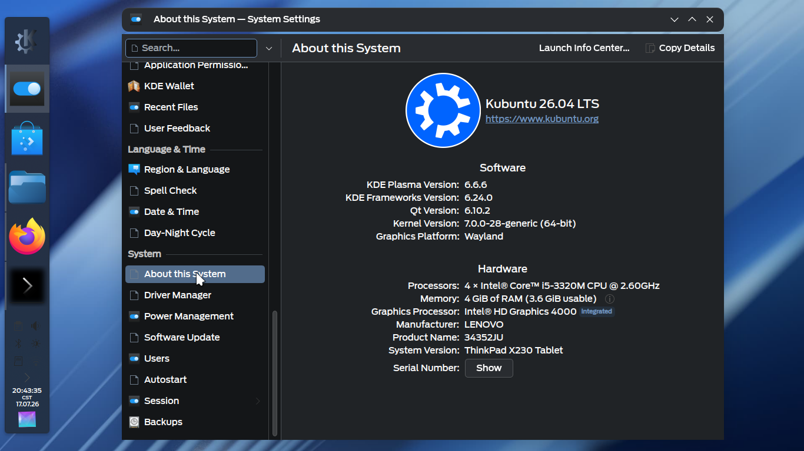

# Fluidity-KDEPlasma
A KDE Plasma theme that "Adapts, to you!". This theme uses the Ford Antenna fonts that are not free, so you'll have to obtain them yourself.
Make sure you have SDDM, and this theme is tested on Kubuntu 26.04 on my main ThinkPad.
Also, the tar.gz files can't be installed through Install from File.. in KDE's settings as it contains multiple themes, so extract them with Ark and then drag them into the appropriate folder.
And I did this, all without AI!
Oh, and we need the Darkly app style for QT and the window decorations.

